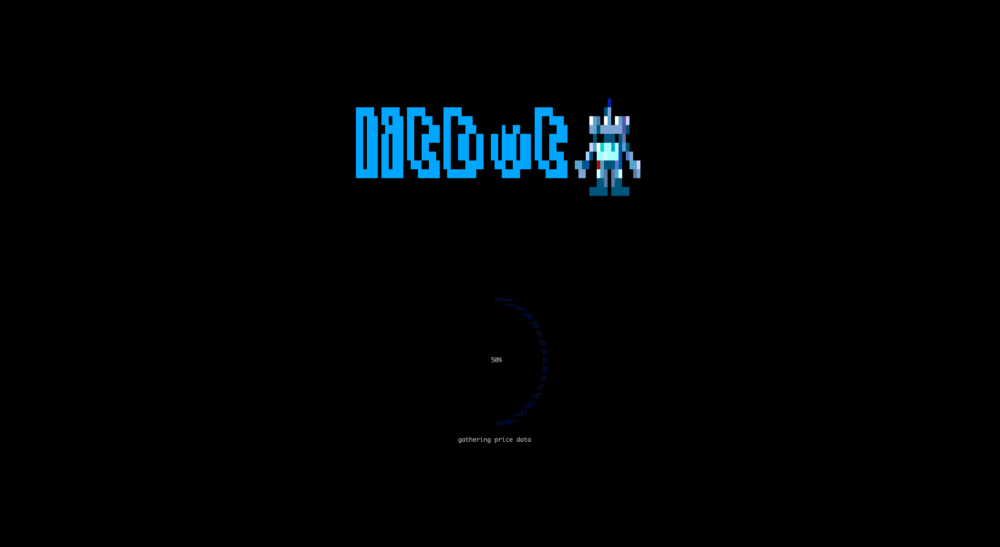
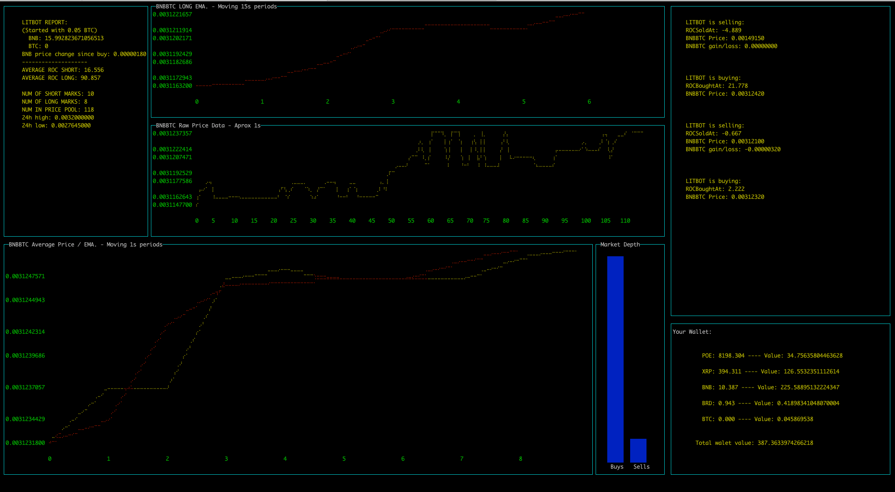

DISCLAIMER: The fastest losing crypto bot out there!! :joy: I went down the rabbithole over two weekends and decided to try and make a crypto terminal dashboard and bot. I got the dashboard part, as far as LITBOT himself, well... :joy:

First it gathers the data it needs to make its **expert** decicions. That data is constantly being updated and old data pushed out.

**Don't worry I never let this psycho really make trades.** It reads your wallet from the Binance API. It just takes your starting balance and starts making pretend trades and keeping track of gains and losses from there purely for fun.

I don't even remember what I was trying to do, bollenger bands and patterns and EMA and ROC.. :joy:






Create a .env file with:
```
BINANCE_PUBLIC_KEY=...
BINANCE_SECRET_KEY=...
```

To install:
```
npm install
```

To run:
```
node litbot.js
```
